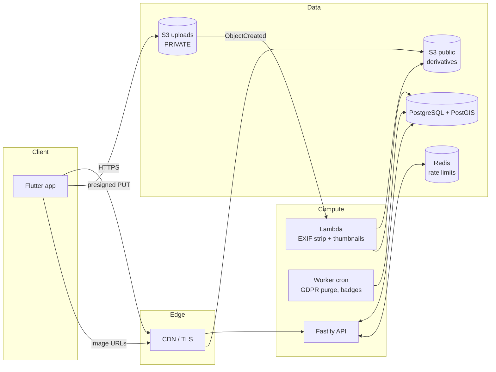
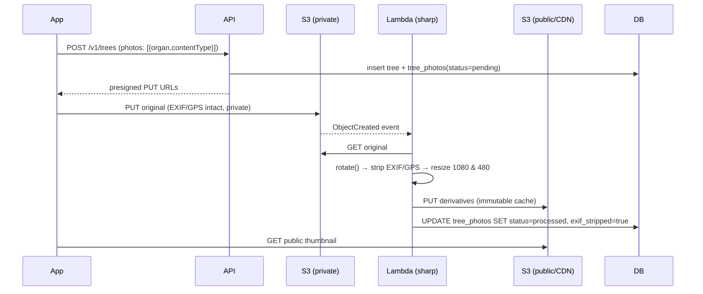

# mwavuli — Architecture & Security Specification

**Status:** Phase 3 design, implemented in this repository.
**Audience:** engineers, reviewers, and security assessors.

mwavuli lets people identify, catalogue, geolocate, and describe the trees around
them, and builds a crowdsourced living map from those contributions. This document
describes the server-side system that backs the mobile app: the data model, the
location-privacy design that is the heart of the product's safety story, the
image-processing pipeline, and the authentication, rate-limiting, moderation, and
data-protection machinery.

The guiding principle is **defence in depth for location data**. A tree's exact
coordinates are sensitive — for heritage trees, rare species, or a contributor's
home garden, precise coordinates can enable poaching, vandalism, or doxxing. The
system is therefore built so that a single mistake (a leaky query, a forgotten
`WHERE` clause, an over-broad API response) cannot expose exact coordinates: the
database itself refuses to return them to anyone but the owner or staff.

## 1. System topology



Originals are uploaded by the client **directly** to a private bucket via a
short-lived presigned URL — they never transit the API. The image Lambda strips
metadata and publishes only derivatives to the public bucket/CDN. The API talks to
Postgres as a restricted role and to Redis for distributed rate-limit counters.

## 2. Request lifecycle and the RLS boundary

Every request-scoped database access runs inside a transaction that first sets two
session variables from the authenticated principal:

```sql
SET LOCAL app.user_id   = '<uuid or empty>';
SET LOCAL app.user_role = 'anon | user | moderator | admin';
```

(implemented in `api/src/db.ts::runAs`). Row-level-security policies read these
through `app.current_user_id()` and `app.is_staff()`. The API connects as
`mwavuli_app`, created `NOSUPERUSER NOBYPASSRLS`, so **RLS is always in force** —
the application cannot opt out. This makes the database the final arbiter of who
can see what, independent of API correctness.

## 3. Data model

Ten migrations (`db/migrations/001`–`010`) define the schema. The important tables:

| Table | Purpose | Privacy notes |
|---|---|---|
| `users` | accounts | stores only birth *year* (COPPA data-minimisation); soft-delete + hard purge |
| `refresh_tokens` | session refresh | stored as SHA-256, revocable, rotated |
| `species` | reference taxonomy | trigram indexes for search; links to GBIF |
| `trees` | the public record | holds the **fuzzy** point only; RLS by visibility/owner/staff |
| `tree_exact_locations` | precise GPS | **separate table, RLS + FORCE**; owner/staff only; reads audited |
| `tree_photos` | image derivatives | originals private; row flips to `processed` by the pipeline |
| `follows`, `comments`, `likes` | social graph | counters maintained by triggers |
| `badges`, `user_badges`, `points_ledger`, `activity` | gamification | append-only ledger; `users.points` is the running total |
| `reports`, `moderation_actions`, `user_blocks` | moderation | powers the admin dashboard |
| `consents`, `data_export_jobs`, `account_deletion_requests`, `audit_log` | privacy/GDPR | consent versioning, export + erasure jobs, tamper-evident audit |
| `api_keys`, `rate_limit_counters` | abuse control | hashed keys; DB fallback limiter |

Geospatial columns use `geography(Point, 4326)` (metre-accurate distance) with
GiST indexes. The feed's map queries use `ST_Intersects(fuzzy_geom, ST_MakeEnvelope(...))`.

## 4. Location privacy model (the crux)

Three mechanisms combine:

**Separation.** The exact point lives in `tree_exact_locations`, physically apart
from `trees`. The public record (`trees.fuzzy_geom`) is the only location most
queries can reach.

**Fuzzing.** When a contributor marks an entry fuzzy (the default), the published
point is randomised uniformly within ~500 m of the true location — computed by
`app.fuzz_point()` and kept consistent with the exact point via
`app.set_tree_location()`. Fuzzing happens on-device *and* server-side, so even a
compromised client cannot force an exact public point. A uniform-in-disc
distribution is used (not a Gaussian) so the true point isn't biased toward the
centre of the published circle.

**Access control + audit.** `tree_exact_locations` has `ENABLE` **and** `FORCE`
row-level security. The read policy admits only staff or the tree's owner:

```sql
CREATE POLICY exact_read ON tree_exact_locations FOR SELECT USING (
  app.is_staff()
  OR EXISTS (SELECT 1 FROM trees t
              WHERE t.id = tree_exact_locations.tree_id
                AND t.owner_id = app.current_user_id()));
```

The only API path that returns exact coordinates (`GET /v1/trees/:id/exact-location`)
writes an `audit_log` entry on every successful read. Because RLS is enforced in
the database, an accidental `SELECT * FROM tree_exact_locations` from the app role
simply returns nothing for rows the caller may not see.

Visibility (`public | followers | private`) is enforced by the `trees_select`
policy, so private and followers-only trees never appear in the public feed even
if a query forgets to filter.

## 5. Image pipeline



`sharp` discards all metadata by default; `.rotate()` bakes in orientation first
so the visible image is correct without keeping the orientation tag. Originals stay
in a bucket with Block Public Access enabled; only stripped derivatives are served.
Thumbnail generation as a serverless function satisfies the brief's "image
processing as a serverless function to generate thumbnails" and keeps the API
stateless and fast.

## 6. Authentication & sessions

Stateless **access JWTs** (default 15 min) carry `sub` (user id) and `role`.
**Refresh tokens** are opaque 256-bit randoms; only their SHA-256 is stored, and
they are **rotated** on every refresh (the old one is revoked), which bounds the
damage of a leaked refresh token and enables server-side revocation/logout.
Passwords are hashed with scrypt (memory-hard, built into Node — argon2id is an
equally acceptable drop-in; the verifier keys off the stored scheme prefix).

**COPPA / 13+.** Registration requires `birthYear` and `acceptTos`. Under-13s are
refused (`400`). Only the birth *year* is retained (data minimisation), plus a
boolean, and a `users_min_age` CHECK constraint backs the rule at the database
level. Guardian-consent tracking has a `consents` slot (`coppa_guardian`) if a
future under-13 experience is ever built.

## 7. Authorization

Three roles: `user`, `moderator`, `admin`. Coarse checks happen in the API
(`requireAuth`, `requireStaff` preHandlers); fine-grained data access is enforced
by RLS. Staff bypass ownership checks in policy (`app.is_staff()`), never by
bypassing RLS itself.

## 8. Rate limiting

`@fastify/rate-limit` applies a global budget keyed by user id (falling back to
IP), with tighter per-route ceilings on expensive endpoints — `/v1/identify`
(upstream model calls) and `/v1/me/export` (heavy assembly). In production the
limiter is backed by Redis so counters are shared across API instances; a
DB-backed fixed-window counter (`app.rate_hit`) is available as a fallback and for
per-subject inspection. `trustProxy` is on so limits key off the real client IP
behind the load balancer.

## 9. Content moderation

Any authenticated user can file a `report` against a tree, comment, or user.
Staff review the queue through the **admin dashboard** (`admin/index.html`), which
calls `GET /v1/admin/metrics` and `GET /v1/admin/reports`, and resolve each report
via `POST /v1/admin/reports/:id/resolve` with an action (`hide`, `remove`,
`restore`, `warn`, `ban`, `dismiss`). Actions update the target's status, record a
`moderation_actions` row, and write to `audit_log`. `user_blocks` lets members
mute abusers independently of staff action.

## 10. GDPR & data protection

**Portability (Art. 20).** `POST /v1/me/export?format=json|csv` assembles the
member's complete data — profile, trees (including their *own* exact coordinates,
which they are entitled to), photos, comments, follows, likes, badges, consents —
inside their own RLS transaction, so nothing belonging to others can leak. Large
accounts can be offloaded to the worker with a signed-URL download; the job is
tracked in `data_export_jobs`.

**Erasure (Art. 17).** `POST /v1/me/deletion` schedules a purge 30 days out (a
grace period; the member can cancel). The `worker` performs the hard delete, which
cascades across all owned rows; object-storage cleanup is a documented TODO in the
worker. Every request and the purge itself are audited.

**Consent & minimisation.** `consents` versions ToS/privacy acceptance. We store
birth year rather than a full birthdate, and never persist precise coordinates in
public payloads.

## 11. Encryption & transport

All client/API and API/upstream traffic is HTTPS/TLS. At rest, Postgres and S3 use
provider-managed encryption (enable RDS storage encryption + S3 SSE-KMS). Secrets
(DB URL, JWT secret) come from a secrets manager, never source. On the device, the
Flutter app stores the offline queue and tokens in the platform keystore
(`flutter_secure_storage`), satisfying "encrypted local storage for offline data".

## 12. Threat model

| Threat | Mitigation |
|---|---|
| Scraping exact coordinates of rare/heritage trees | Separate table + FORCE RLS; public API returns fuzzy only; exact reads audited |
| App bug leaks private/other users' trees | RLS `trees_select`; app role is `NOBYPASSRLS` |
| GPS leaking via photo EXIF | Stripped server-side (pipeline) and on-device before upload; originals never public |
| Credential stuffing / brute force | scrypt hashing; rate limits on `/auth/*`; generic error messages |
| Stolen refresh token | Hashed at rest, rotated each use, revocable |
| API abuse / scraping / cost (identify) | Global + per-route rate limits; API keys hashed with scopes |
| Malicious/abusive content | Report → moderation queue → audited actions; user blocks |
| Coordinate spoofing to un-fuzz | Server recomputes the fuzzy point; client cannot set it directly |
| Under-13 signup (COPPA) | Age gate + DB CHECK; birth-year-only storage |
| Insider misuse of admin powers | All staff reads of exact location + moderation actions in `audit_log` |
| Direct DB compromise | TLS + at-rest encryption; least-privilege app role; secrets in a manager |

## 13. Deployment & scaling

The API is stateless and scales horizontally behind a load balancer (containers on
ECS/Fargate/Kubernetes). Postgres runs on a managed service (RDS/Cloud SQL) with
PostGIS; add read replicas for feed/leaderboard reads and materialise
`leaderboard_week` on a schedule as it grows. The image Lambda scales per-upload
and should front RDS with **RDS Proxy** to avoid connection exhaustion. Redis
(ElastiCache) holds rate-limit counters. Static derivatives are served from a CDN
with long immutable caching.

## 14. Observability

Fastify's structured (pino) logs carry request ids; ship them to a log platform.
Emit metrics for request rate/latency/error by route, rate-limit rejections,
identify-provider latency, pipeline processing time, and export/erasure job
outcomes. `audit_log` is the security-relevant trail and should be exported to
immutable storage.

## 15. Open items (beyond this scaffold)

Wire real S3 object cleanup into the erasure worker; move export assembly fully
async with signed URLs; add push notifications; add abuse-scoring/auto-flagging
ahead of human moderation; and formalise the badge-award rules engine (the
`badges.criteria` JSON is the hook).
